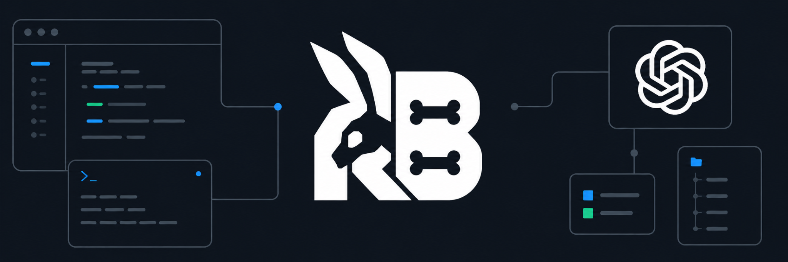

<p align="center">
  
</p>

<h1 align="center">Rabbitbone</h1>

<p align="center">
  
  
  
  
</p>

<p align="center">
  Experimental x86_64 UEFI operating system with its own kernel, VFS, EXT4 stack, shell, userland, and in-kernel test suite.
</p>

## Overview

Rabbitbone is a small amd64 operating system built from scratch for UEFI virtual machines. It is not Linux, not a Unix clone, and not a bootloader demo. The default artifact is a live ISO that boots an independent kernel, loads a RAM-backed root image as a boot module, mounts it at `/disk0`, and starts a disk-backed userland with `/disk0/sbin/init` and `rbsh`.

The current release line is `0.0.3.6`. The default path is UEFI-only. The legacy BIOS image is kept only for regression comparison via `make legacy-image`.

## Highlights

| Area | What exists now |
| --- | --- |
| Boot | UEFI `BOOTX64.EFI`, live ISO packaging, bootinfo v2, UEFI memory-map import, live root module loading |
| Kernel | x86_64 CPU feature bring-up, per-CPU GDT/TSS stacks, IDT, paging, heap, VMM, W^X/NX image protection, panic path, structured logging, shell |
| Filesystems | VFS, ramfs, devfs, tarfs, writable EXT4, indexed extents, split-leaf/depth-2 extent trees, htree directories, metadata repair-lite |
| Storage | Live boot RAM disk, block layer, MBR parsing, ATA PIO, AHCI probing |
| Networking | VMware `e1000`/`e1000e` Ethernet probe path, `/dev/net0`, frame RX/TX queues, `net` diagnostics, DHCP, ARP, DNS lookup, and ICMP ping through `netctl` |
| User mode | ELF64 loader, ring3 transition, `int 0x80` syscalls, `/disk0/sbin/init`, `/disk0/bin/rbsh`, test utilities including `cpuidcheck` and `netctl` |
| Processes | spawn/wait, process registry, fork, exec, fd table, `brk`/`sbrk`, anonymous mmap, file-backed private mmap |
| Scheduling | Preemptive scheduler with SMP topology, AP bootstrap, cross-call, TLB-shootdown, idle, and per-CPU telemetry groundwork |
| Rust boundary | Rust modules for syscall dispatch, usercopy validation, VFS routing, and path policy checks |
| Testing | Host tests plus in-kernel `ktest` coverage for boot, memory, VFS, EXT4, syscalls, scheduler, and ring3 userland |

## Requirements

Host tools:

- `clang`
- `ld.lld`
- `lld-link`
- `llvm-objcopy`
- `make`
- a C++17 compiler
- Python 3
- Rust `1.94.1`

The ISO build is self-contained. It does not require `xorriso`, GRUB, Limine, or mtools.

## Build

```sh
make clean
make
make test
```

Main build outputs:

```text
build/rabbitbone-live.iso
build/BOOTX64.EFI
build/rabbitbone-root.img
build/kernel.elf
build/kernel.bin
build/tools/installer/rabbitbone-install
```

Legacy regression image:

```sh
make legacy-image
```

If you need an uploaded Rust toolchain instead of a system install:

```sh
make clean
scripts/build_with_uploaded_rust.sh /path/to/rust test
scripts/build_with_uploaded_rust.sh /path/to/rust image
```

## Run in VMware

Recommended VM setup:

- x86_64 VM
- UEFI firmware
- Secure Boot disabled
- 512 MiB RAM or more
- CD/DVD attached to `build/rabbitbone-live.iso`
- serial port connected to a file such as `rabbitbone-com1.log`

The tracked VMware template is [vmware/rabbitbone-uefi-live.vmx.example](vmware/rabbitbone-uefi-live.vmx.example). Copy it to `vmware/rabbitbone-uefi-live.vmx` for local runs; non-example `.vmx` files stay ignored.

Important logging behavior:

- the framebuffer/CLI stays readable and does not spam every internal log line;
- detailed logs are still retained in the kernel ring buffer and can be shown with `logs` or `bone logs`;
- the VMware serial log captures the full kernel log stream independently of what is visible on screen.

Because VMware resolves CD-ROM paths relative to `vmware/`, the ISO path inside the VMX is `../build/rabbitbone-live.iso`.

Live ISO layout:

```text
El Torito UEFI boot image
  /EFI/BOOT/BOOTX64.EFI
  /RABBITBONE/KERNEL.BIN
  /RABBITBONE/ROOT.IMG

ROOT.IMG
  sector 0       MBR with one Linux partition
  LBA 2048       installer-generated EXT4 seed filesystem
```

## First commands

Quick tour after boot:

```text
help
logs
mem
heap
boot
mounts
dir /
read /etc/motd
dir /disk0
read /disk0/hello.txt
ktest
```

Useful diagnostics:

```text
ps
procs
lastproc
sched
preempt
cpuidcheck
net
netctl status
dhcp
ping 8.8.8.8
schedtest
runq
tty
statvfs /
pci
ext4
```

Ring3 programs:

```text
run /bin/hello
run /bin/fscheck /disk0/hello.txt
run /bin/writetest
run /bin/preemptcheck
run /bin/fdcheck
run /bin/cpuidcheck
run /bin/procctl
run /bin/forkcheck
run /bin/execcheck
run /bin/execvecheck
run /bin/execfdcheck
spawn /bin/fscheck /disk0/hello.txt
qspawn /bin/hello
```

## Tests

Host side:

```sh
make test
```

Inside Rabbitbone:

```text
ktest
```

A passing in-kernel run ends with:

```text
KTEST_STATUS: PASS
```

`ktest` covers libc helpers, heap, VMM, VFS, ramfs, devfs, tarfs, block/MBR, EXT4 read-write paths, syscalls, timer, scheduler, SMP/AP contracts, ELF loading, and ring3 process behavior.

## Source layout

```text
assets/                README media assets
boot/                  UEFI loader plus retained legacy BIOS loader sources
include/               public Rabbitbone ABI/version headers
kernel/arch/x86_64/    CPU, GDT, IDT, IRQ, paging, entry assembly
kernel/core/           kernel main, shell, logging, panic, ktest
kernel/drivers/        VGA, serial, PIT, PIC, keyboard, boot RAM disk, AHCI, ATA PIO, MBR, block layer, network, SMP/APIC support
kernel/exec/           ELF64 image loader
kernel/fs/             EXT4 reader/writer
kernel/mm/             virtual memory and kernel heap
kernel/proc/           process table and process image management
kernel/rust/           Rust safety-boundary modules
kernel/sched/          task and scheduler code
kernel/sys/            syscall backend
kernel/vfs/            VFS, ramfs, devfs, tarfs, EXT4 adapter
scripts/               build and binary-check scripts, live ISO generator
tests/                 host-side tests
tools/installer/       root image installer and EXT4 seed filesystem generator
user/                  tiny ring3 programs and CRT entry
userlib/               userland syscall wrappers and ABI headers
vmware/                VMware helper files and example configs
```

## Docs

- [Current status](docs/STATUS.md)
- [Release notes](docs/RELEASES.md)
- [VM networking](docs/vm-networking.md)

## Current limits

Rabbitbone is still intentionally narrow in scope:

- SMP remains experimental and virtual-machine oriented; AP startup, CPU-local work, and diagnostics exist, while broader platform IRQ/device routing is still staged
- UEFI live RAM-root boot flow by default
- EXT4 write support only for the implemented and tested regular-file/directory paths
- extent-tree support covered through the tested inline, indexed, split-leaf, and depth-2 cases
- networking is currently VMware Intel virtual NIC oriented, with userland IPv4 helpers rather than a full kernel TCP/IP stack
- no NVMe, USB, GUI, or full Linux-compatible journal descriptor/commit format
- `/dev/prng` and `/dev/urandom_insecure` are deterministic non-cryptographic PRNG devices until real entropy plumbing exists

## License

Rabbitbone is released under the [MIT License](LICENSE).
